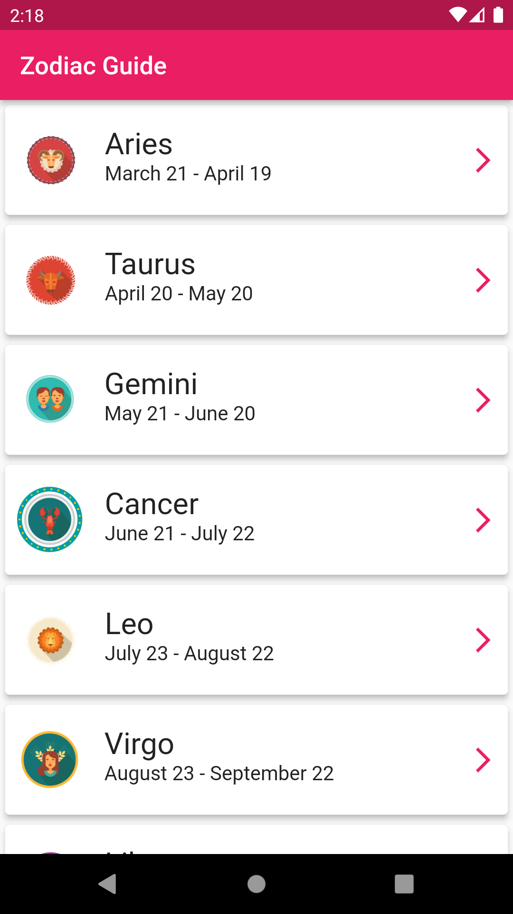

# Zodiac Guide App
This project is the first one I will do among simple Flutter projects.

## Features
- General characteristics of all Zodiac signs
- AppBar that changes color based on the zodiac sign's image

## Ekran Görüntüleri
Screenshot                 | Screenshot                 | Screenshot
:-------------------------:|:-------------------------: | :-------------------------:
 |  | 

### Installing

Here is the apk file for download.
* [APK FILE DOWNLOAD](assets/build/app-release.apk)

### Local Installing
* Just clone the repo.

## Built With
* [Flutter](https://flutter.dev/) - Flutter

## Authors
* [**Yusuf Can Mercan**](https://github.com/cusufcan)
